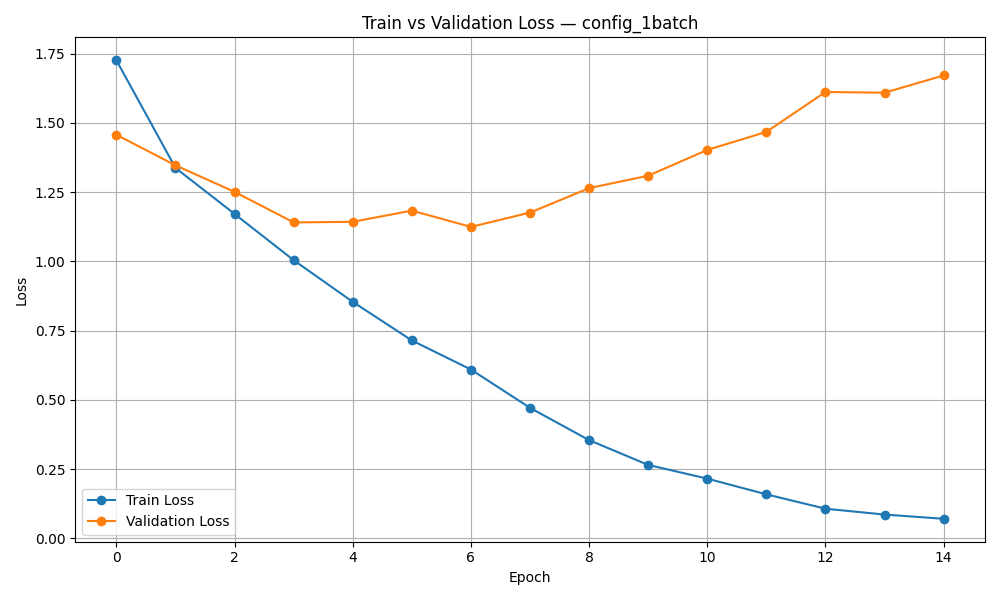
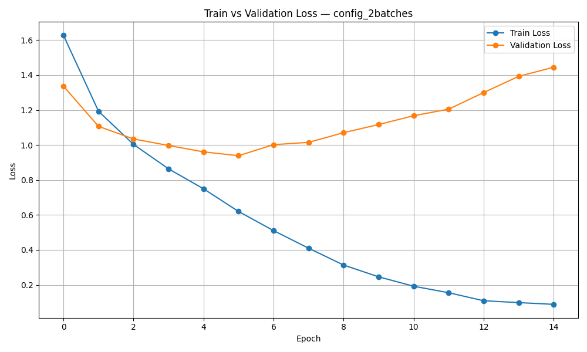
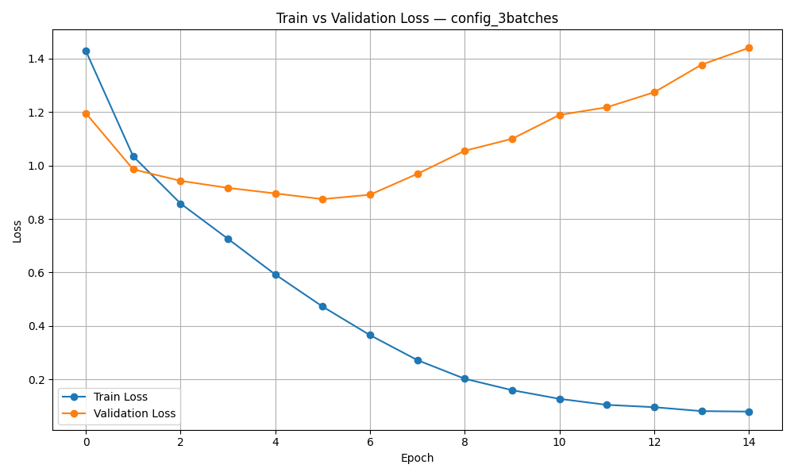
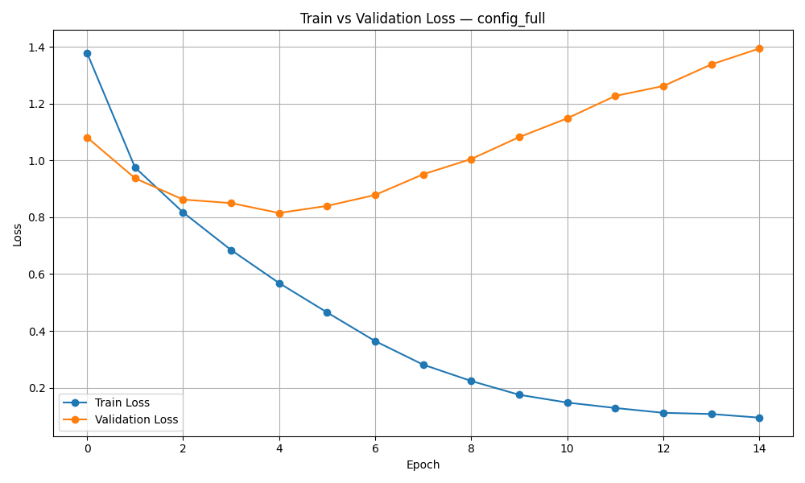

# Lab2 Report: Automating Dataset Extension

## 1. Introduction

The main objective of this laboratory work was to design, implement and evaluate a configuration-driven system for automated dataset extension.  

Using the **CIFAR-10 dataset** (60,000 32×32 RGB images, 10 classes),created dynamic training and validation sets from different combinations of data batches while keeping the test set completely static (`test_batch`).  

Four experiments were conducted with an increasing number of training batches:
- 1 batch (10,000 images)
- 2 batches (20,000 images)
- 3 batches (30,000 images)
- Full (4 batches, 40,000 images)

The goal was to demonstrate how the volume of training data affects final model performance on the same static test set

## 2. Pipeline Description

The pipeline is fully controlled via YAML configuration files (`configs/*.yaml`).  

- **Data management** (`src/data/dataset.py`): Dynamically loads selected batches for training and a fixed validation batch (`data_batch_5`). The test set is always loaded from `test_batch` and remains unchanged in all experiments.
- **Model** (`src/models/cnn.py`): A simple convolutional neural network SimpleCNN consisting of two convolutional layers, max-pooling, and two fully connected layers with dropout.
- **Training** (`src/train.py`): Uses Adam optimizer and CrossEntropyLoss. Training runs for 15 epochs. Train and Validation losses are recorded each epoch, and final evaluation is performed on the static test set.
- **Logging**: All key events, losses and final metrics are logged using Python’s logging module.
- **Visualization**: Train and Validation Loss curves are automatically plotted and saved after each experiment.
- **Results Storage**: Metrics and configuration details are saved as JSON files.

All parameters (batches, learning rate, epochs, etc.) are defined in configuration files, making the process flexible and reproducible

## 3. Model Evaluation

A **SimpleCNN model** was trained for **15 epochs** on each configuration. Final metrics were calculated on the static test set (10 000 images).

### Final Test Results
| Configuration       | Train Batches     | Train Images | Val Images | Accuracy | Precision | Recall  | F1-score |
|---------------------|-------------------|--------------|------------|----------|-----------|---------|----------|
| config_1batch       | [1]               | 10 000       | 10 000     | 0.6277   | 0.6310    | 0.6277  | 0.6262   |
| config_2batches     | [1, 2]            | 20 000       | 10 000     | 0.6755   | 0.6782    | 0.6755  | 0.6755   |
| config_3batches     | [1, 2, 3]         | 30 000       | 10 000     | 0.7105   | 0.7167    | 0.7105  | 0.7106   |
| config_full     | [1, 2, 3, 4]  | 40 000   | 10 000     | 0.7216 | 0.7286 | 0.7216 | 0.7217 |

Main observation: Increasing the training data volume from 10 000 to 40 000 images led to a steady improvement in all metrics. The total gain was +9.39% in accuracy and +9.55% in F1-score.

### Analysis of Loss Curves

**Train vs Validation Loss plots** for all experiments are saved in the `results/` folder:

1. **config_1batch.png**: Train loss decreases rapidly, but validation loss starts rising sharply after epoch 7. Strong overfitting due to very limited training data.
 
2. **config_2batches.png**: Validation loss reaches its minimum around epoch 5–6 and then grows. Overfitting appears earlier than in larger datasets.
 
3. **config_3batches.png**: Similar pattern — minimum validation loss around epoch 5, followed by steady increase. More training data slightly delays the start of overfitting.

4. **config_full.png**: The smoothest curve among all experiments. Validation loss reaches the lowest point around epoch 5–6 and then increases slowly. Even with the largest training set, the model still overfits, but the gap between train and validation loss is smaller compared to smaller configurations.

### Conclusions from the graphs:
- In all four experiments the model shows clear signs of overfitting after 5–7 epochs (train loss continues to decrease while validation loss starts increasing).
- Larger training sets reduce the severity of overfitting and lead to better final generalization on the test set.
- The gap between train and validation loss becomes smaller as the amount of training data increases, indicating improved model stability.

## 4. Best Practices
- **Configuration:** All hyperparameters are controlled via YAML files.
- **Logging:** Python `logging` module with file + console output.
- **Code quality:** Used `black`, `isort`, `ruff`, and `mypy`.
- **Dependency management:** Poetry (`pyproject.toml` + `poetry.lock`).
- **Version control:** GitHub repository with meaningful commit messages.

## 5. Reflection

The configuration-driven approach worked very well and allowed easy switching between experiments without changing code. The fixed validation batch (`data_batch_5`) and static test set provided a fair and consistent comparison of how training data volume affects performance.

The results and loss curves clearly show that more training data leads to higher accuracy and better generalization. However, even with 40 000 images the model overfits after several epochs, suggesting the need for regularization techniques.

With more time the following improvements could be implemented:
- Early stopping based on validation loss.
- Data augmentation.
- Learning rate scheduling.
- A deeper architecture (e.g. ResNet).

Overall, the lab successfully demonstrated positive impact of larger training sets on model quality.

## GitHub repository
https://github.com/sophiakoroliova/mlops_lab2.git